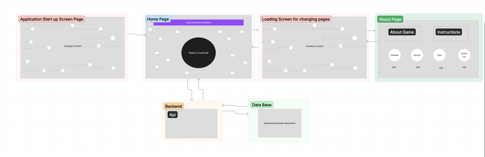

# Fortune 3D

## About our app

Fortune 3D is an immersive space-themed fortune-telling platform that takes users on an extraordinary journey through the cosmos. This interactive website application offers a captivating and entertaining way to delve into the mysteries of the universe. By harnessing the vast expanse of space as a backdrop, users can explore personalized and mesmerizing glimpses into their future. CosmicOracle aims to ignite curiosity and provide a celestial escape from the mundane, offering a cosmic adventure that transports users beyond the confines of everyday life. Embrace the unknown, seek amusement, and embark on a captivating cosmic diversion.    
Click the "Oracle" near the Earth and ask a question! Wait for the response.   
We hope you enjoy our app!
Any advice given by our app should not be taken seriously.  

## Authors
Darran Holmes
Sheldon Pierce
Dominick Martin
Tyler Huntley

### WireFrame
https://www.figma.com/file/rLMTk3BIZfG4aFWiKH04n0/Untitled?type=whiteboard&node-id=0-1&t=IZRyOlEEQgtYoVh6-0

### Domain Model/Data Base Schema

  

## Getting Started

```
To run locally

    npm install
    npm run dev
```

Open [http://localhost:3000](http://localhost:3000) with your browser to see the result.

## Deploy on Vercel

[Frontend Deployed](https://fortune-3-d-frontend.vercel.app/)  
[Backend Deployed](https://fortune-backend.vercel.app/api/v1/fortune/)  

## Resources

[Three JS](https://threejs.org/docs/)  
[ChatGPT](gpt.md)  
[Three.js Crash Course For Beginners](https://www.youtube.com/watch?v=_OwJV2xL8M8)  
